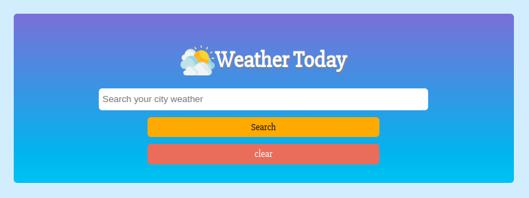

# Weather_today_js

> This is a Microverse javascript project which creates a weather application.The requirement of this project was to build a weather application that uses async, await and fetch to get data from external api. This app display all kind of weather information of a city that user is looking for.





## Live Demo

[WeatherApp]()

## Built With

- HTML
- CSS
- VANILA JAVASCRIPT
- Atom text editor
- Webpack
- Npm
- Async, Await, Fetch api

# Getting Started

To get a local copy of the repository please run the following commands on your terminal:

```
$ cd <folder>
```

```bash

$ git clone `https://github.com/ajkacca457/Weather_today_js.git`
$ cd Weather_today_js
$ Run `npm install` to install the necessary modules

```

# Authors

👤 **Avijit Karmaker**

- Github: [@Avijit](https://github.com/ajkacca457)
- Linkedin:[@Avijit](https://www.linkedin.com/in/avijit-karmaker-8738a54)

## 🤝 Contributing

Contributions, issues and feature requests are welcome!

## Show your support

Give a ⭐️ if you like this project!

## Copyright
This is a project developed by Microverse Student as the part of skill curriculum.
